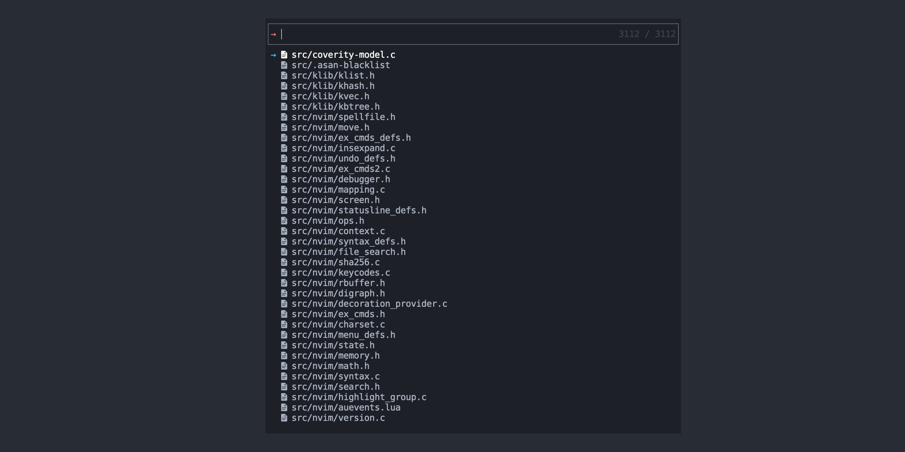
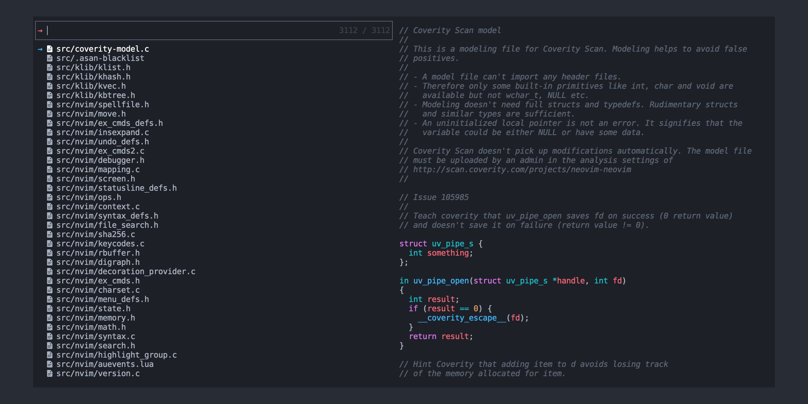

# Telescope Minimal Layout

A minimal layout for [telescope.nvim](https://github.com/nvim-telescope/telescope.nvim).




<br>

## 🚛 Installation

Using [vim-plug](https://github.com/junegunn/vim-plug):

```vim
Plug 'josa42/nvim-telescope-minimal-layout'
```

Using packer.nvim

```lua
use {
  'josa42/nvim-telescope-minimal-layout'
}
```

<br>

## 🔧 Setup

Usage:

```lua
local telescope = require('telescope')

telescope.setup({
  defaults = {
    layout_strategy = 'minimal',

    -- [optional] adjust layout
    layout_config = {
      minimal = {
        prompt_position = 'top',
        prompt_min_width = 40,
        prompt_max_width = 80,
        preview_width = 80,
      }
    },

    -- [optional] hide preview by default
    preview = {
      hide_on_startup = true,
    },

    -- [optional] toggle preview
    mappings = {
      i = {
        ['<c-p>'] = require('telescope.actions.layout').toggle_preview,
      },
    },
 })

telescope.load_extension('minimal_layout')
```

**Valid keys for minimal config**

- `prompt_position`:  
  Determines the prompt position: "top" or "bottom"

- `prompt_min_width`:  
  Determines the prompt minimal width.

- `prompt_max_width`:  
  Determines the prompt maximal width.

- `preview_width`:  
  Determines the preview width.

<br>

## License

[MIT © Josa Gesell](LICENSE)
